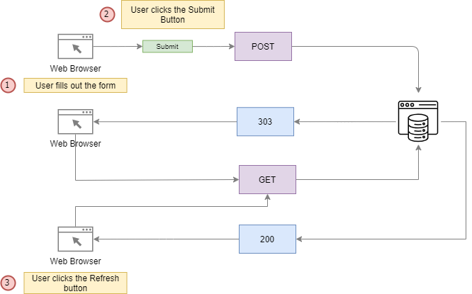

# <span style="color:green">Traitement des Formulaires

## <span style="color:blue">PHP Form

**Pour créer un formulair on utilise la balise html `form`, cette balise dispose de deux attribus indispansable du moment ou on fait du PHP:**

- `action`: spécifie le scripte qui serat executé à la soumission du formulaire.
- `method`: spécifie la méthode HTTP pour soumettre le formulaire. Les méthodes de formulaire les plus couramment utilisées sont POST et GET.

**Exemple**

```html
<form action="form.php" method="post">
  <div>
    <label for="email">Email:</label>
    <input type="email" id="email" name="email" />
  </div>
  <button type="submit">Submit</button>
</form>
```

### HTTP POST method

Si un formulaire utilise la méthode POST, le navigateur Web inclura les données du formulaire dans le corps de la requête HTTP. Après avoir soumis le formulaire, vous pouvez accéder aux données du formulaire via le tableau associatif $\_POST en PHP.

**Exemple**

```php
<?php

if (isset($_POST['email'])) {
	var_dump($_POST['email']);
}
```

### HTTP GET method

Lorsque vous soumettez un formulaire à l'aide de la méthode GET, vous pouvez accéder aux données du formulaire en PHP via le tableau associatif $\_GET.

Contrairement à la méthode POST, la méthode GET ajoute les données du formulaire dans l'URL qui traite le formulaire. Supposons que l'URL qui traite le formulaire soit http://localhost/form.php. Lorsque vous entrez l'e-mail sous la forme hello@phptutorial.net et soumettez un formulaire, vous verrez que la valeur de l'e-mail est ajoutée à l'URL comme ceci : `http://localhost/form.php?email=hello%40phptutorial.net `

**Exemple**

```php
<?php

if (isset($_GET['email'])) {
	var_dump($_GET['email']);
}
```

## TP

**Le TP consiste à créer un projet progressif basé sur les formulaires en PHP. L'objectif final est de concevoir un formulaire d'inscription utilisateur (nom, prénom, date de naissance, mot de passe) et d'enregistrer les données fournies par l'utilisateur dans un fichier CSV. De plus, il est demandé de mettre en place un formulaire en méthode GET pour afficher la liste de toutes les inscriptions.**

### Étape 1: Création du Formulaire d'Inscription

Commencez par créer un fichier index.php qui contiendra le formulaire d'inscription. Voici un exemple de code pour un formulaire simple :

    ```html
        <form action="traitement.php" method="post">
            <label for="nom">Nom:</label>
            <input type="text" id="nom" name="nom"><br><br>

            <label for="prenom">Prénom:</label>
            <input type="text" id="prenom" name="prenom"><br><br>

            <label for="date_naissance">Date de Naissance:</label>
            <input type="date" id="date_naissance" name="date_naissance"><br><br>

            <label for="mdp">Mot de passe:</label>
            <input type="password" id="mdp" name="mdp"><br><br>

            <input type="submit" value="Soumettre">
        </form>
    ```

### Étape 2: Traitement du Formulaire

Créez un fichier traitement.php pour gérer les données du formulaire. Vous pouvez récupérer les valeurs soumises et les enregistrer dans un fichier CSV. Voici un exemple de code pour enregistrer les données dans un fichier utilisateurs.csv :

```php
<?php
if ($_SERVER["REQUEST_METHOD"] == "POST") {
    $nom = $_POST['nom'];
    $prenom = $_POST['prenom'];
    $date_naissance = $_POST['date_naissance'];
    $mdp = $_POST['mdp'];

    $nouvelle_entree = [$nom, $prenom, $date_naissance, $mdp];

    $fichier = fopen('utilisateurs.csv', 'a');
    fputcsv($fichier, $nouvelle_entree);
    fclose($fichier);

    echo "Données enregistrées avec succès.";
}
?>
```

### Étape 3: Affichage de la Liste des Inscriptions

Pour afficher la liste de toutes les inscriptions, vous pouvez créer un fichier liste.php qui lira le fichier CSV et affichera les données. Voici un exemple de code pour lire et afficher les données du fichier utilisateurs.csv :

```php
<?php
    $fichier = fopen('utilisateurs.csv', 'r');
    echo "<ul>";
    while (($ligne = fgetcsv($fichier)) !== false) {
        echo "<li>" . implode(", ", $ligne) . "</li>";
    }
    echo "</ul>";
    fclose($fichier);
?>
```

### Faille Cross-Site Scripting (XSS):

Les attaquants insèrent du code JavaScript malveillant dans les champs du formulaire, ce qui peut compromettre la sécurité des utilisateurs. Pour éviter cela, assurez-vous de filtrer et d'échapper correctement les données avant de les afficher.

**\*Avant d’afficher les entrées de l’utilisateur sur une page Web, vous devez toujours échapper aux données. Pour ce faire, vous utilisez la fonction htmlspecialchars()**

```php
<?php
    if (isset($_POST['name'])) {
        $name = htmlspecialchars($_POST['name']);
        echo "Thanks $name for your subscription.<br>";
    }
```

## Eercice:

Effectuez des recherches approfondies sur le concept de Formulaire d'auto-traitement, puis illustrez-le avec un exemple concret.

## <span style="color:blue">Les fonctions de filtrage

- ### filter_has_var:
  Cette fonction est utilisée pour vérifier si une variable de type spécifique existe dans une requête HTTP. Elle prend deux paramètres : le type de variable à vérifier et le nom de la variable. Par exemple, pour vérifier si un paramètre GET nommé "email" existe, on peut utiliser:
  `INPUT_POST`, `INPUT_GET`,`INPUT_COOKIEINPUT_SERVERINPUT_ENV`

```php
    if (filter_has_var(INPUT_GET, 'email')) {
        echo 'La variable email existe.';
    } else {
        echo 'La variable email n\'existe pas.';
    }
```

Contrairement à la fonction isset(), la fonction filter_has_var() ne lit pas le contenu du tableau $\_POST. Il vérifie les variables dans le corps de la requête. Par conséquent, l'exemple suivant renvoie false:

```php
<?php
    $_POST['email'] = 'example@phptutorial.net';
    if(filter_has_var(INPUT_POST, 'email')) { // return false
        // ...
    }
```

- ### filter_var:
  Cette fonction est utilisée pour filtrer une seule variable avec un filtre spécifique. Elle prend trois paramètres : la variable à filtrer, le filtre à appliquer et des options facultatives. Par exemple, pour valider une adresse e-mail, on peut utiliser :

_ref-> function.filter-var.html_

```php
    $email = 'test@example.com';
    if (filter_var($email, FILTER_VALIDATE_EMAIL)) {
        echo 'L\'adresse email est valide.';
    } else {
        echo 'L\'adresse email n\'est pas valide.';
    }

```

- ### A chercher filter_input

## <span style="color:blue">Form Validation

Lors du traitement d'un formulaire, il est essentiel de valider les entrées de l'utilisateur pour garantir que les données sont dans un format valide.

Il existe deux types de validations : côté client et côté serveur :

- La validation côté client est effectuée dans les navigateurs Web des utilisateurs. Pour valider les données côté client, vous pouvez utiliser la validation HTML5 ou JavaScript .

- La validation côté serveur valide les données sur le serveur Web à l'aide de PHP. Pour valider des données en PHP, vous pouvez utiliser les fonctions filter_var()et filter_input().

## TP: Implementer les autres type de felds

Vous allez effectuer des recherches sur chaque notion et voire comment les implémenter(html/php).

- Case à cocher PHP
- Cases à cocher multiples
- Bouton radio
- Option de sélection

## <span style="color:blue">PHP CSRF

Cross-Site Request Forgery (CSRF) est une attaque qui exploite la confiance de l'utilisateur pour effectuer des actions non désirées sur un site web.

Cette attaque se produit lorsqu'un utilisateur authentifié est induit à exécuter une action sur un site sans son consentement, souvent en utilisant des demandes HTTP falsifiées.

## <span style="color:blue">PRG (Post-Redirect-Get)

**La technique PRG (post-redirect-get) vous aide à résoudre le problème de double soumission. Le post-redirection-get fonctionne comme suit :**

- Tout d'abord, le formulaire est soumis à l'aide de la méthode HTTP POST.
- Deuxièmement, le serveur fait quelque chose, par exemple, met à jour la base de données, traite un paiement, envoie un e-mail et redirige le navigateur vers la page de résultats.
- Troisièmement, le navigateur effectue la deuxième requête vers la page de résultats à l'aide de la méthode HTTP GET.
- Enfin, le serveur renvoie la page de résultats et le navigateur l'affiche.



## <span style="color:blue"> TP: Formulair de Contact

### Objectif :

**Créer un formulaire de contact basique en PHP pour permettre aux utilisateurs d'envoyer des messages à l'administrateur du site.
Instructions :**

Créez un fichier HTML contenant un formulaire de contact avec les champs suivants :

Nom complet
Adresse e-mail
Objet du message
Message lui-même
Créez un fichier PHP pour traiter les données soumises par le formulaire :

Validez les données entrées par l'utilisateur (par exemple, assurez-vous que l'e-mail est au bon format).
Envoyez un e-mail à l'administrateur du site contenant les détails du message.
Utilisez des mécanismes de sécurité pour éviter les attaques telles que l'injection de code et le spam.

Personnalisez la page de confirmation pour informer l'utilisateur que son message a été envoyé avec succès.

## <span style="color:blue">File Upload

Suivez le tutoriel disponible à [ce lien](https://www.simplilearn.com/tutorials/php-tutorial/file-upload-in-php) et pratiquez ensuite.
