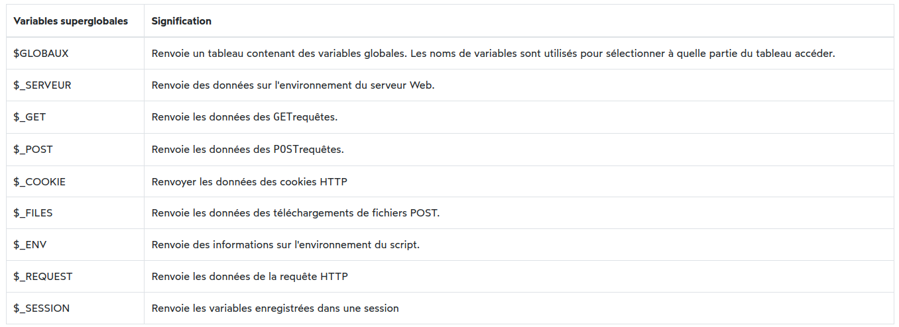

# <span style="color:green">Fondamentaux de PHP

## <span style="color:blue">BASES (Syntaxe,Variables,Constantes,commentaires)

Comme pour le HTML, vous devez disposer de la balise d'ouverture pour démarrer le code PHP :

```
<?php
```

Si vous mélangez du code PHP avec du HTML, vous devez avoir la balise englobante :

```
?>
```

Par exemple:

```
<!DOCTYPE html>
<html lang="en">
	<head>
		<meta charset="UTF-8">
		<title>PHP Syntax</title>
	</head>
	<body>
		<h1><?php echo 'PHP Syntax'; ?></h1>
	</body>
</html>
```

Pour afficher de message sur l’écran, utiliser l’instruction echo ,print ,print_r ou var_dump.
Cependant, si un fichier contient uniquement du code PHP, la balise fermente est facultative :

```
<?php 	echo 'PHP Syntax';
```

### Sensibilité à la casse

PHP est **partiellement** sensible à la casse. Savoir ce qui est sensible à la casse et ce qui ne l'est pas est très important pour éviter les erreurs de syntaxe.

Si vous disposez d'une fonction telle que `count`, vous pouvez l'utiliser comme `COUNT`. Cela fonctionnerait correctement.

Les éléments suivants ne sont pas sensibles à la casse en PHP :

- Constructions PHP telles que [if](https://www.phptutorial.net/php-tutorial/php-if/) , [if-else](https://www.phptutorial.net/php-tutorial/php-if-else/) , [if-elseif](https://www.phptutorial.net/php-tutorial/php-if-elseif/) , [switch](https://www.phptutorial.net/php-tutorial/php-switch/) , [while](https://www.phptutorial.net/php-tutorial/php-while/) , [do-while](https://www.phptutorial.net/php-tutorial/php-do-while/) , etc.
- Des mots-clés tels que `true`et `false`.
- [](https://www.phptutorial.net/php-tutorial/php-functions/)[Noms](https://www.phptutorial.net/php-oop/php-objects/) de fonctions et de classes [définis par l'utilisateur](https://www.phptutorial.net/php-tutorial/php-functions/) .

En revanche, [les variables](https://www.phptutorial.net/php-tutorial/php-variables/) sont sensibles à la casse. par exemple, `$message`et `$MESSAGE`sont des variables différentes.

### Déclarations

Un script PHP se compose généralement d'une ou plusieurs instructions. Une instruction est un code qui fait quelque chose, par exemple attribuer une valeur à une variable et appeler une fonction.

Une instruction se termine toujours par un point-virgule ( `;`). L'exemple suivant montre une instruction qui attribue une chaîne littérale à la `$message`variable :

`$message = "Hello";`

### Constantes,commentaires

#### Pour definite des constante on utilise soit la fonction define() ou le mot-clé const

```php
	<?php
		define('WIDTH','1140px');
		echo WIDTH;
```

```php
	<?php
		const WIDTH = '1140px';
		echo WIDTH;
```

#### PHP prend en compte plusieurs types de commentaires:

- Monoligne: commentaire sur une seule ligne

```php
	<?php
		// Voici un commentaire
		# Voici un commentaire
```

- Multi-ligne : commentaire sur plusieurs lignes

```php
	<?php
		/*
			Tout
			ceci
			est un
			commentaire
		*/
```

### Concaténation de chaînes de caractères

En PHP, les chaînes de caractères peuvent être concaténées en utilisant le point (.).

#### Exemple:

```php
	<?php
		$nom = "Toto";
		$age = 25;
		$message = "Bonjour, je m'appelle ". $nom. "et j’ai ". $age . "ans.";
```

On peut aussi utiliser la fonction concat() pour concaténer les chaînes de caractères.

### Utilisation des variables dans les chaînes de caractères

En PHP, les variables peuvent être incluses dans les chaînes de caractères en utilisant les accolades { }.

#### Exemple:

```php
	<?php
		$nom = "Toto";
		$message = "Bonjour, je m'appelle {$nom}.";
```

Ces éléments de base sur les variables en PHP vous aideront à comprendre comment déclarer et utiliser des variables dans vos scripts PHP.

### Les constantes prédéfinies et les constantes magiques en PHP

PHP possède de nombreuses constantes mais Il y en a neuf qu’on appelle des constantes magiques .Si vous vous rappelez bien, nous avons dit que la valeur des constantes ne change pas toute au longue du script mais ce n’est pas le cas pour celles-ci car leur valeur va changer en fonction de l’endroit dans le script où elles vont être utilisées. On les reconnaît par le fait que leur nom commence par deux underscores et se termine de la même manière sauf une (1). Voici ces constantes magiques :

- \_\_FILE\_\_ Contient le chemin complet et le nom du fichier
- \_\_DIR\_\_ Contient le nom du dossier dans lequel est le fichier
- \_\_LINE\_\_ Contient le numéro de la ligne courante dans le fichier
- \_\_FUNCTION\_\_ Contient le nom de la fonction actuellement définie
- \_\_CLASS\_\_ Contient le nom de la classe actuellement définie
- \_\_METHOD\_\_ Contient le nom de la méthode actuellement utilisée
- \_\_NAMESPACE\_\_ Contient les namespaces courant
- \_\_TRAIT\_\_ Contient le nom du trait
- ClassNam ::class Contient le nom entièrement qualifié de la classe

### Résumé

- PHP est partiellement sensible à la casse.
- Les constructions PHP, les noms de fonctions et les noms de classes ne sont pas sensibles à la casse, alors que les variables sont sensibles à la casse.
- Une instruction se termine par un point-virgule (;).
- Les espaces et les sauts de ligne n'ont pas d'importance en PHP ;

## <span style="color:blue">TYPES DE DONNÉES

Les variables en PHP peuvent contenir différents types de données, notamment des chaînes de caractères (string), des entiers (integer), des nombres à virgule flottante (float), des booléens (boolean), des tableaux (array), des objets (object), des ressources (resource) et des null (null).

#### Les types numeric strings

En PHP, les chaînes numériques sont des chaînes de caractères qui contiennent une représentation de nombres.
Il est possible de vérifier si une chaîne de caractères est numérique en utilisant la fonction is_numeric().

#### Le types null

En PHP, le type de donnée null représente une variable qui ne contient aucune valeur. Cela signifie que la variable existe, mais elle ne contient rien. En PHP, la valeur null est utilisée pour indiquer qu'une variable n'a pas de valeur. Elle est souvent utilisée pour initialiser une variable sans lui attribuer une valeur spécifique.

Pour tester si une variable contient la valeur null, on peut utiliser la fonction is_null()

## <span style="color:blue">TRENS-TYPAGE

### Conversion de chaînes en nombres

#### Exemple:

```php
	<?php
		$nombre = "51"; $nombre = (int) $nombre; /* $nombre vaut maintenant 51 et est de type entier (int)*/
```

### Conversion de nombres en chaînes

#### Exemple:

```php
	<?php
		$nombre = 51; $nombre = (string) $nombre; /* $nombre vaut maintenant "51" et est de type chaîne (string)*/
```

### Conversion de booléens en entiers

#### Exemple:

```php
	<?php
		$booleen = true; $entier = (int) $booleen; /* $entier vaut maintenant 1 (true est converti en 1) et est de type entier (int)*/
```

## <span style="color:blue"> LES OPÉRATEURS

![[operateur-php.jpg]]

## <span style="color:blue"> STRUCTURE DE CONTROLE

- ### l'instruction PHP if
  L' `if`instruction vous permet d'exécuter une instruction si une expression est évaluée à `true`. Ce qui suit montre la syntaxe de l' `if`instruction :

```
<?php  if ( expression )
	 statement;
```

### Accolades

Si vous souhaitez exécuter plusieurs instructions dans le `if`bloc, vous pouvez utiliser des accolades pour regrouper plusieurs instructions comme ceci :

```
<?php
	if ( expression ) {
		statement1;
		statement2;
		// more statement
	}
```

### Incorporer `if`la déclaration en HTML

Pour intégrer une `if`instruction dans un document HTML, vous pouvez utiliser la syntaxe ci-dessus. Cependant, PHP fournit une meilleure syntaxe qui vous permet de bien mélanger l'instruction if avec HTML :

```html
<?php if ( expession) : ?>
<!-- HTML code here -->
<?php endif; ?>
```

L'exemple suivant utilise l' `if`instruction qui affiche le lien d'édition `$is_admin`si`true` :

```html
<!DOCTYPE html>
<html lang="en">
  <head>
    <meta charset="UTF-8" />
    <title>PHP if Statement Demo</title>
  </head>
  <body>
    <?php $is_admin = true; ?>
    <?php if ( $is_admin ) : ?>
    <a href="#">Edit</a>
    <?php endif; ?>
    <a href="#">View</a>
  </body>
</html>
```

- ### PHP if else

#### Syntaxe

```php
<?php
	if ( expression ) {
		// code block
	} else {
		// another code block
	}
```

- PHP if elseif

#### Syntaxe

```php
<?php
	if (expression1) {
		statement;
	} elseif (expression2) {
		statement;
	} elseif (expression3) {
		statement;
	}
```

- PHP switch

#### Syntaxe

```php
<?php
	$role = 'admin';
	$message = '';

	switch ($role) {
		case 'admin':
			$message = 'Welcome, admin!';
			break;
		case 'editor':
			$message = 'Welcome! You have some pending articles to edit';
			break;
		case 'author':
			$message = 'Welcome! Do you want to publish the draft article?';
			break;
		case 'subscriber':
			$message = 'Welcome! Check out some new articles.';
			break;
		default:
			$message = 'You are not authorized to access this page';
	}
	echo $message;
```

- PHP for

#### Syntaxe

```php
<?php
	for (start; condition; increment) {
		statement;
	}
```

#### Eemple

```php
<?php
	$total = 0;

	for ($i = 1; $i <= 10; $i++) {
		$total += $i;
	}

	echo $total;
```

- PHP while

#### Syntaxe

```php
<?php
	$total = 0;
	$number = 1;
	while ($number <= 10) {
		$total += $number;
		$number++;
	}
	echo $total;
```

- PHP do while

```php
<?php
	do {
		statement;
	} while (expression);
```

- PHP break
  L'instruction break met fin à l'exécution de la boucle for, do...while, while, ou switch actuelle.
  Généralement, vous utilisez la déclaration break avec l'instruction if qui spécifie la condition pour mettre fin à la boucle.

La déclaration break accepte éventuellement un nombre qui indique le nombre de structures imbriquées à sortir.

Si vous ne spécifiez pas le nombre en option, il prend la valeur par défaut de 1. Dans ce cas, la déclaration break met fin uniquement à la structure immédiatement englobante.

- PHP continue
  L' instruction continue est utilisée dans une structure de boucle telle que for, do...while et do-while, Elle vous permet d'ignorer immédiatement toutes les instructions qui la suivent et de recommencer l'itération suivante depuis le début.

Comme l' instruction break , continue accepte également un nombre facultatif qui spécifie le nombre de niveaux de boucles englobantes qu'elle ignorera.

#### Syntaxe

```php
<?php
	for ($i = 0; $i < 10; $i++) {
		if ($i % 2 === 0) {
			continue;
		}
		echo "$i\n";
	}

```

## <span style="color:blue"> TABLEAUX

- ### Tableau PHP

##### syntaxe

```php
<?php
	$tableau1 = array(1, 2, 3);
	$tableau2 = [1, 2, 3];

```

**Pour afficher le contenu d'un tableau, vous utilisez les fonctions var_dump(), print_r().**

**Pour accéder à un élément d'un tableau, vous spécifiez l'index de l'élément entre crochets.**

**Pour ajouter un élément à un tableau, vous utilisez la syntaxe suivante : `$array_name[] = new_element;`**
`

```php
	<?php
		$scores = [1, 2, 3];
		$scores[] = 4;

```

**Pour supprimer un élément d'un tableau, vous utilisez la unset()fonction**

```php
	<?php
		$scores = [1, 2, 3];
		unset($scores[1]);
```

**Pour obtenir le nombre d'éléments dans un tableau, vous utilisez la count()fonction.**

```php
	<?php
		$scores = [1, 2, 3, 4, 5];
		echo count($scores);
```

- ### Tableaux associatifs

```php
	<?php
		$prof_matieres = [];
		$prof_matieres['SABIROU'] = 'PHP,BD';
		$prof_matieres['CLEMENT'] = 'RESEAUX,JS';
		print_r($prof_matieres);
```

- ### PHP foreach

#### Syntaxe

```
foreach ($array_name as $element) {
	// process element here
}
```

```php
<?php
	//
	$capitals = [
		'Japan' => 'Tokyo',
		'France' => 'Paris',
		'Germany' => 'Berlin',
		'United Kingdom' => 'London',
		'United States' => 'Washington D.C.'
	];

	foreach ($capitals as $country => $capital) {
		echo "The capital city of {$country} is $capital" . '<br>';
	}
```

- ### Fonction sur les Tableaux

  1.  ## array_unshift
      **Cette fonction permet d'ajouter un ou plusieurs elements au debut d'un tableau**

```php
<?php
	$permissions = [
		'edit',
		'delete',
		'view'
	];

	array_unshift($permissions, 'new');

	print_r($permissions);
```

2.  ## array_push
    **Cette fonction permet d'ajouter un ou plusieurs elements à la fin d'un tableau**

```php
<?php
	$numbers = [1, 2, 3];
	array_push($numbers, 4, 5);
	print_r($numbers);

```

3.  ## array_shift

**To remove an element from the end of an array and return it, you use the array_pop() function.**

```php
<?php
	$numbers = [1, 2, 3];
	$first_number = array_shift($numbers);
	print_r($numbers);
```

4.  ## array_pop

```php
<?php

	$numbers = [1, 2, 3];
	$last_number = array_pop($numbers);
	echo $last_number; // 3
	print_r($numbers);

```

5.  ## array_key_exists

```php
<?php
	//
	$capitals = [
		'Japan' => 'Tokyo',
		'France' => 'Paris',
		'Germany' => 'Berlin',
		'United Kingdom' => 'London',
		'United States' => 'Washington D.C.'
	];

	foreach ($capitals as $country => $capital) {
		echo "The capital city of {$country} is $capital" . '<br>';
	}
```

6.  ## array_keys

```php
<?php
	$roles = [
		'admin' => 1,
		'approver' => 2,
		'editor' => 3,
		'subscriber' => 4
	];
	$result = array_key_exists('admin', $roles);
	var_dump($result); // bool(true)
```

#### PHP array_key_exists() vs isset()

```php
<?php
	$roles = [
		'admin' => 1,
		'approver' => 2,
		'editor' => 3,
		'subscriber' => 4
	];
	var_dump(isset($roles['approver']));  // bool(true)
	var_dump(array_key_exists('approver', $roles)); // bool(true)
```

7.  ## in_array

```php
<?php
	$user_ids = [10, '15', '20', 30];
	$result = in_array(15, $user_ids, true);
	var_dump($result); //  bool(false)
```

8.  ## array_merge

```php
<?php
	$server_side = ['PHP'];
	$client_side = ['JavaScript', 'CSS', 'HTML'];
	$full_stack = array_merge($server_side, $client_side);
	print_r($full_stack);
```

9.  ## array_reverse

```php
<?php
	$numbers = [10, 20, 30];
	$reversed = array_reverse($numbers);
	print_r($reversed);
	print_r($numbers);
```

10. ## Spread Operator

```php
<?php
	$numbers = [4,5];
	$scores = [1,2,3, ...$numbers];
	print_r($scores);
```

## <span style="color:blue"> OPÉRATIONS SUR LES TABLEAUX

1. ### sort: La fonction sort() trie les éléments d'un tableau en place par ordre croissant.

**La fonction sort() a deux paramètres :**

`$array` est le tableau d'entrée à trier.
L’argument `$flags` est un ou une combinaison de plusieurs indicateurs qui modifient le comportement de tri de la fonction.
Le paramètre $flags est par défaut SORT_REGULAR. Cela signifie que la fonction comparera les éléments du tableau d'entrée à l'aide d'opérateurs de comparaison.

**Pour combiner plusieurs indicateurs, vous utilisez le | caractère, par exemple, SORT_STRING | SORT_FLAG_CASE. La fonction sort() renvoie vrai en cas de succès ou faux en cas d'échec.**

#### Eemple1:

```php
<?php
	$numbers = [4,5];
	$scores = [1,2,3, ...$numbers];
	print_r($scores);
```

#### Eemple2:

```php
<?php
	$names = ['Bob', 'John', 'Alice'];
	sort($names, SORT_STRING);

	print_r($names);
```

#### La fonction rsort() est comme la fonction sort() sauf qu'elle trie les éléments d'un tableau par ordre décroissant.

```php
<?php
	$ranks = ['A-1', 'A-2', 'A-12', 'A-11'];
	rsort($ranks, SORT_STRING | SORT_NATURAL);
	print_r($ranks);
```

2. ### uasort La fonction uasort() trie les éléments d'un tableau associatif avec une fonction de comparaison définie par l'utilisateur et maintient l'association d'index.

```php
<?php
	$countries = [
		'China' => ['gdp' => 12.238 , 'gdp_growth' => 6.9],
		'Germany' => ['gdp' => 3.693 , 'gdp_growth' => 2.22 ],
		'Japan' => ['gdp' => 4.872 , 'gdp_growth' => 1.71 ],
		'USA' => ['gdp' => 19.485, 'gdp_growth' => 2.27 ],
	];

	// sort the country by GDP
	uasort($countries, function ($x, $y) {
		return $x['gdp'] <=> $y['gdp'];
	});

	// show the array
	foreach ($countries as $name => $stat) {
		echo "$name has a GDP of {$stat['gdp']} trillion USD with a GDP growth rate of {$stat['gdp_growth']}%" . '<br>';
	}
```

## TP Manipulation de Tableaux en PHP

Pour ce TP, vous allez effectuer des recherches sur différentes fonctions de manipulation de tableaux en PHP. Pour chaque fonction, vous expliquerez son fonctionnement, puis vous fournirez un programme pour tester vos affirmations.

Il est essentiel de souligner l'importance de la précision dans la rédaction de votre texte, en veillant à ce que les termes techniques soient correctement utilisés et que la syntaxe soit adéquate. Assurez-vous également de fournir des exemples de code clairs et pertinents pour illustrer chaque fonction de manipulation de tableaux en PHP.

- `asort`
- `usort`
- `ksort`
- `uksort`
- `array_map`
- `array_filter`
- `array_reduce`

## <span style="color:blue"> LES FONCTIONS

1. ### la syntaxe

```php
<?php
	function function_name(parm1,param2,.....) {
		statement;
	}
```

2. ### Exemple: Nombre pairs ou impair

```php
<?php
	function check($number){
		if($number % 2 == 0){
			echo "ce nombre est pair";
		}
		else{
			echo "ce nombre est impaire";
		}
	}
	$number = 39;
	check($number)
?>

```

3. ### Portées des variables PHP
   En PHP, les variables peuvent avoir différentes portées, telles que :

- Portée Locale : Les variables déclarées à l'intérieur d'une fonction ont une portée locale et ne sont accessibles que dans cette fonction.
- Portée Globale : Les variables déclarées en dehors de toutes fonctions ont une portée globale et peuvent être utilisées partout dans le script.
- Portée Statique : Les variables statiques conservent leur valeur entre les appels de fonction.
  **Exemple:**

```php
<?php
	function get_counter() {
		static $counter = 1;
		return $counter++;
	}
	echo get_counter() .  '<br>'; // 1
	echo get_counter() .  '<br>'; // 2
	echo get_counter() .  '<br>'; // 3
```

- Portée de Classe : Les variables déclarées à l'intérieur d'une classe ont une portée de classe et peuvent être accessibles via l'instance de la classe.

4. ### Bon à Savoir.

- On peux ajouter des Default Parameters
- Depuis PHP 8.0, vous pouvez utiliser des arguments nommés pour les fonctions. Les arguments nommés vous permettent de transmettre des arguments à une fonction en fonction des noms des paramètres plutôt que des positions des paramètres.

5. ### Variables superglobales



6. ### Type Hints
   En PHP, les annotations de type, également connues sous le nom de "Type Hints" ou "Type Declarations", sont des fonctionnalités introduites dans les versions plus récentes du langage pour améliorer la lisibilité du code en spécifiant les types de données attendus pour les paramètres de fonction et les valeurs de retour.

```php
function additionner(int $a, int $b): int {
    return $a + $b;
}
```

7. ### Strict Typing
   En PHP, le "Strict Typing" fait référence à une fonctionnalité introduite dans PHP 7. Il permet de définir explicitement le type des variables utilisées dans un script. Cela signifie que les types des variables doivent être déclarés et respectés lors de l'affectation de valeurs.

```php
<?php
	declare(strict_types=1);
	function additionner(int $a, int $b) {
		return $a + $b;
	}
	echo additionner(5, 10); // Résultat : 15
	echo additionner("5", 10); // Erreur fatale en mode Strict Typing
```

8. ### Variadic Functions
   En PHP, les "Variadic Functions" (ou fonctions variadiques) sont des fonctions qui acceptent un nombre variable d'arguments. Cela signifie que vous pouvez appeler une fonction avec un nombre différent d'arguments à chaque fois.

```php
<?php
	function sum(...$numbers)
	{
		$total = 0;
		for ($i = 0; $i < count($numbers); $i++) {
			$total += $numbers[$i];
		}

		return $total;
	}
	echo sum(10, 20) . '<br>'; // 30
	echo sum(10, 20, 30) . '<br>'; // 60

```

### Résumé

    - Une fonction est un bloc de code nommé qui exécute une tâche spécifique.
    - Utilisez des fonctions pour créer du code réutilisable.
    - Utilisez l'instruction return pour renvoyer une valeur d'une fonction.

## <span style="color:blue"> FONCTIONS AVANCÉES

1. ### Anonymous Functions
   En PHP, les fonctions anonymes, également appelées "closures", sont des fonctions sans nom qui peuvent être assignées à des variables, passées comme des arguments de fonctions ou retournées par d'autres fonctions.

**Exemple 1**

```php
$addition = function($a, $b) {
    return $a + $b;
};

echo $addition(2, 3); // Affichera 5
```

**Exemple 2**

```php
	function creerFonctionMultiplier($facteur) {
		// Retourne une fonction anonyme qui multiplie un nombre par le facteur donné
		return function($nombre) use ($facteur) {
			return $nombre * $facteur;
		};
	}

	// Utilisation de la fonction pour créer une fonction de multiplication par 5
	$multiplierPar5 = creerFonctionMultiplier(5);

	// Appel de la fonction anonyme pour multiplier un nombre par 5
	echo $multiplierPar5(10); // Résultat : 50

```

2. ### Arrow Functions
   En PHP, les "Arrow Functions" sont une fonctionnalité introduite dans la version 7.4 du langage. Ces fonctions fléchées offrent une syntaxe concise pour définir des fonctions anonymes ou des closures de manière plus compacte.

**passer de ça**

```php
$addition = function($a, $b) {
    return $a + $b;
};
echo $addition(2, 3); // Résultat : 5
```

**à ça**

```php
$addition = fn($a, $b) => $a + $b;
echo $addition(2, 3); // Résultat : 5
```

3. ## Variable Functions

En PHP, les "Fonctions Variables" font référence à la capacité de traiter les noms de fonctions comme des variables. Cela signifie que vous pouvez assigner une fonction à une variable et l'appeler ensuite en utilisant cette variable. Cette fonctionnalité est particulièrement utile dans des cas où vous devez dynamiquement déterminer quelle fonction exécuter en fonction de certaines conditions ou paramètres.

```php
// Définition d'une fonction
function direBonjour() {
    echo "Bonjour!";
}

// Assignation de la fonction à une variable
$maFonction = 'direBonjour';

// Appel de la fonction via la variable
$maFonction(); // Cela affichera "Bonjour!"

```
